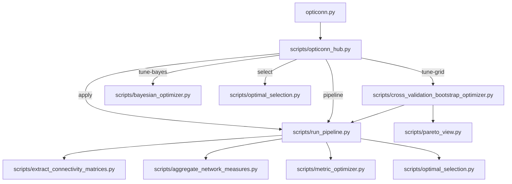

# OptiConn Pipeline

**OptiConn** is an unbiased, modality-agnostic connectomics optimization and analysis toolkit. It automates the discovery of optimal tractography parameters through systematic cross-validation, then applies those parameters to generate analysis-ready brain connectivity datasets.

## Third-party software (not redistributed)

This repository contains only OptiConn source code under the MIT License. It does **not** include or redistribute third-party executables or vendored third-party libraries.

OptiConn depends on third-party software that you must install separately, including:
- Python packages listed in `pyproject.toml` (installed via your Python environment)
- A tractography backend executable, depending on what you run:
  - DSI Studio (installed separately; OptiConn calls your local DSI Studio executable)
  - MRtrix3 (installed separately or via `./install.sh --mrtrix-install`)

---

## Docker (reproducible builds)

If you want to simulate a "fresh OS" installation for reproducibility (e.g., for JOSS review), you can build OptiConn in a clean Docker image. The build downloads Python packages during `docker build`.

Important: the image intentionally does **not** bundle or download DSI Studio. For full tractography runs you must provide a compatible DSI Studio binary yourself.

Note: the image also does **not** bundle MRtrix3 by default.

Build a minimal runtime image:

```bash
docker build --target runtime -t opticonn:runtime .
docker run --rm opticonn:runtime --help
```

On Apple Silicon (arm64), if you need to run an x86_64 (amd64) DSI Studio binary inside Docker, build and run with:

```bash
docker build --platform=linux/amd64 --target runtime -t opticonn:runtime-amd64 .
docker run --rm --platform=linux/amd64 opticonn:runtime-amd64 --help
```

Build and serve documentation:

```bash
docker build --target docs -t opticonn:docs .
docker run --rm -p 8000:8000 opticonn:docs
```

If you have a Linux DSI Studio binary available on the host, you can mount it and point `DSI_STUDIO_PATH` at it (example):

```bash
docker run --rm \
  --platform=linux/amd64 \
  -e DSI_STUDIO_PATH=/dsi/dsi_studio \
  -v /absolute/path/to/dsi_studio:/dsi/dsi_studio:ro \
  opticonn:runtime \
  python scripts/validate_setup.py --config configs/braingraph_default_config.json --no-input-test
```

Note: the mounted DSI Studio executable must match the container architecture (e.g. `linux/amd64`). Mounting a macOS `.app` binary into a Linux container will not work.

---

## 🔧 Installation Guide

### 1. Prerequisites

- Python 3.10 or newer
- Git and basic build tools (`build-essential` on Linux, Xcode Command Line Tools on macOS)
- At least one tractography backend installed:
  - DSI Studio (required for the DSI backend): https://dsi-studio.labsolver.org/download.html
  - MRtrix3 (required for the MRtrix backend): https://www.mrtrix.org/
- At least 20 GB free disk space for intermediate results

Note: the repository does not ship DSI Studio or Python dependencies; the installer sets up a local environment on your machine.

> OptiConn is supported on macOS and Linux. Windows is not supported in this release.

### 2. Quick install (macOS & Linux)

```bash
# Clone the repository
git clone https://github.com/MRI-Lab-Graz/opticonn.git
cd opticonn

# Provision the curated Python virtual environment + validate/install a backend

# Option A: DSI Studio backend (validate executable)
./install.sh --dsi-path /usr/local/bin/dsi_studio

# Option B: MRtrix backend (install locally via micromamba into tools/mrtrix3-conda/)
./install.sh --mrtrix-install

# Option C: MRtrix backend (use an existing MRtrix3 install)
# ./install.sh --mrtrix
# or
# ./install.sh --mrtrix-bin /path/to/mrtrix3/bin

# Activate the virtual environment
source braingraph_pipeline/bin/activate
```

Use `./install.sh --help` to see all backend options.

For safe validation (no changes), use:

```bash
./install.sh --mrtrix --dry-run
```

### 3. Verify the setup

```bash
source braingraph_pipeline/bin/activate
python scripts/validate_setup.py --config configs/braingraph_default_config.json
```

The validator checks Python dependencies, DSI Studio accessibility (via the `DSI_STUDIO_PATH` environment variable set during installation), and configuration basics.

---

## 📂 Demo Data

For testing the pipeline, we recommend using our open dataset hosted on OpenNeuro:

**Dataset ds003138**: [https://openneuro.org/datasets/ds003138/versions/1.0.1](https://openneuro.org/datasets/ds003138/versions/1.0.1)

This dataset contains diffusion MRI data compatible with the pipeline and is ideal for running initial tests or demonstrations.

The lightweight CLI demo pulls a public HCP Young Adult sample from the data-hcp/lifespan GitHub release mirror ([100307.qsdr.fz](https://github.com/data-hcp/lifespan/releases/download/hcp-ya/100307.qsdr.fz)) to keep the download small.

---

## 🚀 The OptiConn Workflow

OptiConn offers two powerful methods for parameter discovery: **Bayesian Optimization** (`tune-bayes`, recommended for efficiency) and **Grid/Random Search** (`tune-grid`, for exhaustive baselines).

### Method A: tune-bayes (Recommended) ⭐

Intelligently discovers optimal parameters using Gaussian Processes. Finds the best configuration in 20-50 iterations (vs. thousands for grid search).

```bash
# Run Bayesian optimization with subject sampling
python opticonn.py tune-bayes \
  -i /data/fiber_bundles \
  -o studies/demo_bayes \
  --config configs/braingraph_default_config.json \
  --modalities qa fa \
  --n-iterations 30 \
  --sample-subjects
```

**Why use this?**
- **Fast:** Converges in 2-3 hours.
- **Smart:** Learns from previous iterations to find the "sweet spot".
- **Robust:** `--sample-subjects` ensures parameters work across the population, not just one subject.

**Output:**
**Outputs (per modality):**
- `bayesian_optimization_manifest.json`: index of modality-specific runs.
- `<output>/<modality>/bayesian_optimization_results.json`: best parameters for that modality.
- `<output>/<modality>/iterations/`: per-iteration logs and artifacts.

### Method B: tune-grid (Grid/Random)

Systematic cross-validation across two independent waves. Best for establishing a rigorous baseline or testing a specific, small set of combinations.

```bash
python opticonn.py tune-grid \
  -i /data/fiber_bundles \
  -o studies/demo_grid \
  --quick
```

**Key options:**
- `--quick`: Uses tiny micro tuning for fast demonstration.
- `--subjects N`: Number of subjects to use for validation (default: 3).

---

### Step 2: Select (`opticonn select`)

Analyze results from either method and select the best parameter combination:

```bash
# For Bayesian results:
python opticonn.py select \
  -i studies/demo_bayes --modality qa
  

# For Grid/Random tuning results:
python opticonn.py select \
  -i studies/demo_grid/sweep-<uuid>/optimize \
  
```

**What it does:**
- **Bayesian:** Displays the best parameters found and prepares the config for application.
- **Grid/Random:** Automatically ranks candidates by QA scores and consistency across waves.
- Optionally launches interactive web dashboard with `--interactive` (grid outputs only).

### Step 3: Apply to Full Dataset (`opticonn apply`)

Apply the optimal parameters to your complete dataset:

```bash
python opticonn.py apply \
  -i /data/all_subjects \
  --optimal-config studies/demo_bayes/qa/bayesian_optimization_results.json \
  -o studies/final_analysis
```

**What it does:**
- Extracts connectivity using optimal parameters for all subjects
- Runs full optimization and selection pipeline
- Generates analysis-ready CSV files

**Final output:**
```text
studies/final_analysis/
├── 01_connectivity/        # Connectivity matrices per atlas
├── 02_optimization/        # Quality scores and rankings
└── 03_selection/          # Analysis-ready CSVs
    ├── FreeSurferSeg_qa_analysis_ready.csv
    ├── FreeSurferDKT_Cortical_qa_analysis_ready.csv
    └── optimal_selection_summary.txt
```

---

## ⚡ Quick Start Examples

### Recommended: tune-bayes Workflow

```bash
# 1. Find optimal parameters (smart search)
python opticonn.py tune-bayes \
  -i /data/pilot \
  -o studies/bayes_opt \
  --config configs/braingraph_default_config.json \
  --modalities qa fa \
  --n-iterations 30 \
  --sample-subjects

# 2. Select results
python opticonn.py select \
  -i studies/bayes_opt --modality qa
  

# 3. Apply to full dataset
python opticonn.py apply \
  -i /data/full_dataset \
  --optimal-config studies/bayes_opt/qa/bayesian_optimization_results.json \
  -o studies/final
```

### Alternative: tune-grid Workflow

```bash
# 1. Run tune-grid
python opticonn.py tune-grid -i /data/pilot -o studies/test --quick

# 2. Select best candidate
python opticonn.py select -i studies/test/sweep-*/optimize

# 3. Apply to full dataset
python opticonn.py apply \
  -i /data/full_dataset \
  --optimal-config studies/test/sweep-*/optimize/selected_candidate.json \
  -o studies/final
```

---

## 🧪 CLI Demo (everything at a glance)

Run these on a tiny pilot subset to see all major commands and options:

```bash
# Bayesian optimization (recommended)
python opticonn.py tune-bayes \
  -i /data/pilot \
  -o demo/bayes \
  --config configs/braingraph_default_config.json \
  --n-iterations 15 \
  --sample-subjects

# Grid/random tuning (quick demo)
python opticonn.py tune-grid \
  -i /data/pilot \
  -o demo/grid \
  --quick \
  --subjects 2 \
  --max-parallel 2

# Select best candidate (works for both outputs)
python opticonn.py select -i demo/bayes --modality qa
python opticonn.py select -i demo/grid/sweep-*/optimize --prune-nonbest

# Apply to a larger dataset using the chosen config
python opticonn.py apply -i /data/all_subjects \
  --optimal-config demo/bayes/qa/bayesian_optimization_results.json \
  -o demo/final

# (Optional) Run the classic pipeline in one shot
python opticonn.py pipeline --step all \
  --input /data/all_subjects \
  --output demo/pipeline \
  --config configs/braingraph_default_config.json \
  

# (Optional) Sensitivity analysis for interpretability
python opticonn.py sensitivity -i /data/pilot -o demo/sensitivity \
  --config configs/braingraph_default_config.json \
  --parameters fa_threshold turning_angle tract_count \

### New: one-shot demo helper

For a minimal end-to-end run (download sample data, tune-bayes, select, apply):

```bash
python scripts/opticonn_demo.py --step all

# Run individual phases if desired
python scripts/opticonn_demo.py --step 1   # tune-bayes
python scripts/opticonn_demo.py --step 2   # select
python scripts/opticonn_demo.py --step 3   # apply
```

### Cross-validation demo (seeding from Bayesian)

If you want to validate parameter robustness across waves using the same tiny sample:

```bash
python scripts/opticonn_cv_demo.py --workspace demo_workspace_cv

# Optional: run specific modalities
python scripts/opticonn_cv_demo.py --workspace demo_workspace_cv --modalities qa fa
```

By default it seeds **per modality** from `demo_workspace/results/bayes/<modality>/bayesian_optimization_results.json` (override with `--from-bayes`), fixes the metrics/atlases from your base config, and runs two bootstrap waves with 3 subjects each.
```

---

## 🔧 Advanced: Direct Pipeline Execution

For users who already know their optimal parameters, the `pipeline` command runs the traditional extraction → optimization → selection workflow:

```bash
python opticonn.py pipeline --step all \
  --input /data/fiber_bundles \
  --output studies/direct_run \
  --config configs/braingraph_default_config.json
```

**Pipeline steps:**

| Step | Purpose | Output |
|------|---------|--------|
| 01 | Connectivity extraction | `01_connectivity/` with per-atlas matrices |
| 02 | Network quality optimization | `02_optimization/optimized_metrics.csv` |
| 03 | Quality-based selection | `03_selection/*_analysis_ready.csv` |

**Step control:**
- `--step 01`: Run only extraction
- `--step 02`: Run only optimization (requires existing 01 output)
- `--step 03`: Run only selection (requires existing 02 output)
- `--step analysis`: Run steps 02+03 (skip extraction)
- `--step all`: Run complete pipeline 01→02→03

---

## 🎯 Deep Dive: Bayesian Optimization

Bayesian optimization provides an intelligent alternative to grid/random search for finding optimal tractography parameters. Instead of exhaustively testing all combinations, it uses a Gaussian Process to model the parameter-quality relationship and strategically samples the most promising regions.

### Subject Sampling Strategies

The optimizer supports three strategies for handling subject variability:

| Strategy | Flag | Behavior | Runtime | Robustness | Use Case |
|----------|------|----------|---------|------------|----------|
| **Single Subject** | (default) | Same subject for all iterations | ~2 hours | Low | Quick exploration |
| **Bootstrap** | `--n-bootstrap 3` | Same 3 subjects for all iterations | ~6 hours | Medium | Stable optimization |
| **Subject Sampling** ⭐ | `--sample-subjects` | Different subject per iteration | ~2 hours | **High** | **Production (recommended)** |

**Why Subject Sampling works:** The Gaussian Process models `f(params) = signal + noise`, where noise represents subject variability. By seeing different subjects, it learns parameters that consistently perform well across the population.

### Configuration File

The optimizer uses `sweep_parameters` in your config JSON to define parameter ranges:

```json
{
  "sweep_parameters": {
    "description": "Bayesian optimization parameter ranges",
    "tract_count_range": [10000, 200000],
    "fa_threshold_range": [0.05, 0.3],
    "min_length_range": [5, 50],
    "turning_angle_range": [30.0, 90.0],
    "step_size_range": [0.5, 2.0],
    "track_voxel_ratio_range": [1.0, 5.0],
    "connectivity_threshold_range": [0.0001, 0.01]
  }
}
```

All ranges are `[min, max]` bounds that the Bayesian optimizer will intelligently sample.

---

## 🧠 OptiConn CLI Commands Reference

### Global Options (all commands)

- `--version`: Show OptiConn version
- `--dry-run`: Print commands without executing them

### `tune-bayes` - Bayesian optimization

```bash
python opticonn.py tune-bayes -i DATA_DIR -o OUTPUT_DIR --config CONFIG [options]
```

**Required:**
- `-i, --data-dir`: Directory containing .fz or .fib.gz files
- `-o, --output-dir`: Output directory for optimization results
- `--config`: Base configuration JSON file

**Optional:**
- `--n-iterations N`: Number of optimization iterations (default: 30)
- `--n-bootstrap N`: Bootstrap samples per evaluation (default: 3)
- `--max-workers N`: Parallel workers (default: 1)
- `--sample-subjects`: Use different subject per iteration (recommended)
- `--verbose`: Show detailed progress

### `tune-grid` - Grid/Random tuning

```bash
python opticonn.py tune-grid -i DATA_DIR -o OUTPUT_DIR [options]
```

**Required:**
- `-i, --data-dir`: Directory containing .fz or .fib.gz files
- `-o, --output-dir`: Output directory for tuning results

**Optional:**
- `--quick`: Run tiny demonstration tuning (configs/sweep_micro.json)
- `--subjects N`: Number of subjects for validation (default: 3)
- `--max-parallel N`: Max combinations to run in parallel per wave
- `--extraction-config`: Override extraction config
- `--no-report`: Skip quality and Pareto reports
- `--no-validation`: Skip setup validation
- `--verbose`: Show DSI Studio commands and detailed progress

### `select` - Promote best candidate

```bash
python opticonn.py select -i INPUT_PATH [options]
```

**Required:**
- `-i, --input-path`: Grid-tuning optimize directory **or** Bayesian results JSON file

**Optional:**
- `--prune-nonbest`: Delete non-optimal combo outputs to save disk space

### `apply` - Apply optimal parameters to full dataset

```bash
python opticonn.py apply -i DATA_DIR --optimal-config CONFIG [-o OUTPUT_DIR] [options]
```

**Required:**
- `-i, --data-dir`: Directory containing full dataset (.fz or .fib.gz files)
- `--optimal-config`: Path to selected_candidate.json from selection step

**Optional:**
- `-o, --output-dir`: Output directory (default: analysis_results)
- `--analysis-only`: Run only analysis on existing extraction outputs
- `--candidate-index N`: Select specific candidate by 1-based index (default: 1)
- `--verbose`: Show detailed progress
- `--quiet`: Minimal console output

### `pipeline` - Advanced pipeline execution

```bash
python opticonn.py pipeline --step STEP [options]
```

**Options:**
- `--step {01,02,03,all,analysis}`: Which pipeline step(s) to run
- `-i, --input`: Input directory or file
- `-o, --output`: Output directory
- `--config`: Configuration file (default: configs/braingraph_default_config.json)
- `--data-dir`: Alternative way to specify input data
- `--cross-validated-config`: Use cross-validation outputs
- `--quiet`: Minimal console output

---

## 📌 Configuration Files

### `configs/braingraph_default_config.json`

Primary extraction configuration used by default in pipeline and tuning commands.

**Key settings:**
- `dsi_studio_cmd`: path to the DSI Studio executable
- `atlases`: which atlases to extract (e.g., FreeSurferDKT_Cortical, FreeSurferDKT_Tissue, FreeSurferSeg)
- `connectivity_values`: metrics such as `count`, `fa`, `qa`, `ncount2`
- `tract_count`, `thread_count`, and detailed `tracking_parameters`
- `connectivity_options`: output types and thresholds
- `sweep_parameters`: ranges (supports MATLAB-style strings like `0.3:0.2:0.7`) and sampling method (`grid`, `random`, `lhs`)

**Usage:**

```bash
# Validate configuration
python scripts/json_validator.py configs/braingraph_default_config.json

# Use in pipeline
python opticonn.py pipeline --step all \
   --input /path/to/fz \
   --output studies/custom_run \
   --config configs/my_custom_config.json
```

Schema reference: `dsi_studio_config_schema.json`

---

## 🧪 Complete Workflow Example

Below is a concrete session for a dataset stored in `/data/P124`:

1. **Activate the environment and set DSI Studio path**

   ```bash
   source braingraph_pipeline/bin/activate
   export DSI_STUDIO_CMD=/Applications/dsi_studio.app/Contents/MacOS/dsi_studio
   ```

2. **Run tune-grid on pilot data**

   ```bash
   python opticonn.py tune-grid \
     -i /data/P124/pilot_subjects \
     -o studies/p124_sweep \
    --subjects 3
   ```

3. **Select best parameters**

   ```bash
   python opticonn.py select \
    -i studies/p124_sweep/sweep-*/optimize
   ```

4. **Apply to full dataset**

   ```bash
   python opticonn.py apply \
     -i /data/P124/all_subjects \
    --optimal-config studies/p124_sweep/sweep-*/optimize/selected_candidate.json \
     -o studies/p124_final
   ```

5. **Review results**
   - `studies/p124_final/03_selection/*_analysis_ready.csv`: Ready for statistical analysis
   - `studies/p124_final/02_optimization/optimized_metrics.csv`: Quality scores
   - `studies/p124_final/03_selection/optimal_selection_summary.txt`: Summary report

---

## 🧠 Expert Settings & Advanced Toolkit

### Individual Script Control

While `opticonn` commands orchestrate the complete workflow, you can also run individual scripts directly for fine-grained control:

**Extraction (Step 01):**
```bash
python scripts/extract_connectivity_matrices.py \
  --config configs/braingraph_default_config.json \
  --batch \
  --input /data/fibers \
  --output studies/manual_run
```

**Optimization (Step 02):**
```bash
python scripts/metric_optimizer.py \
  --input studies/manual_run/01_connectivity \
  --output studies/manual_run/02_optimization
```

**Selection (Step 03):**
```bash
python scripts/optimal_selection.py \
  --input studies/manual_run/02_optimization \
  --output studies/manual_run/03_selection \
  --plots
```

### Utility Scripts

| Script | Purpose |
| ------ | ------- |
| `scripts/aggregate_network_measures.py` | Merge per-subject network metrics |
| `scripts/cross_validation_bootstrap_optimizer.py` | Multi-wave QA campaigns |
| `scripts/bootstrap_qa_validator.py` | Validate QA batches |
| `scripts/json_validator.py` | Validate configuration files |
| `scripts/quick_quality_check.py` | Spot-check diversity and sparsity |
| `scripts/pareto_view.py` | Generate Pareto fronts from diagnostics |
| `scripts/validate_setup.py` | Pre-flight environment check |

---

## 🗺️ Script Architecture



**Key components:**
- `opticonn.py`: CLI entry point with venv bootstrapping
- `scripts/opticonn_hub.py`: Command router (`tune-bayes`, `tune-grid`, `select`, `apply`, `pipeline`)
- `scripts/run_pipeline.py`: Orchestrates 3-step workflow
- `scripts/extract_connectivity_matrices.py`: DSI Studio interface
- `scripts/cross_validation_bootstrap_optimizer.py`: Grid/random tuning engine
- `scripts/optimal_selection.py`: Candidate selection and final output generation

---

## 📊 Diagnostics & Pareto Analysis

Every grid-tuning combination writes `diagnostics.json` with parameters, scores, and network measures:

```text
studies/<name>/sweep-<uuid>/optimize/<wave>/combos/sweep_0001/diagnostics.json
```

### Generate Pareto Front

Surface combinations balancing quality, cost, and network properties:

```bash
python scripts/pareto_view.py \
  studies/sweep/optimize/bootstrap_qa_wave_1 \
  studies/sweep/optimize/bootstrap_qa_wave_2 \
  -o studies/sweep/optimize/optimization_results \
  --plot
```

**Outputs:**
- `pareto_front.csv`: Pareto-efficient combinations
- `pareto_candidates_with_objectives.csv`: All combos with objectives
- `pareto_front.png`: Visualization (with `--plot`)

**Tuning:**
- `--score selection_score`: Use Step 02 selection score
- `--density-range 0.08 0.25`: Adjust preferred density corridor

---

## ✅ Troubleshooting

### DSI Studio Not Found

Set the path explicitly:

```bash
export DSI_STUDIO_CMD=/path/to/dsi_studio  # macOS/Linux
```

Or update `configs/braingraph_default_config.json`:

```json
{
  "dsi_studio_cmd": "/Applications/dsi_studio.app/Contents/MacOS/dsi_studio"
}
```

### Validate Configuration

Before long runs:

```bash
python scripts/validate_setup.py --config configs/braingraph_default_config.json
```

### Check Dependencies

```bash
source braingraph_pipeline/bin/activate
pip check
```

---

## 📚 Further Reading

- **DSI Studio Documentation**: https://dsi-studio.labsolver.org/
- **Configuration Schema**: `dsi_studio_config_schema.json`
- **Example Configs**: `configs/` directory
- **Script Help**: Add `--help` to any command for detailed options

---

## 🤝 Contributing

Issues and pull requests welcome at https://github.com/MRI-Lab-Graz/opticonn

---

## 📄 License

See `LICENSE` file for details.

---

## 📖 Citation

If you use OptiConn in your research, please cite:

```
[Citation details to be added - see CITATION.cff]
```
