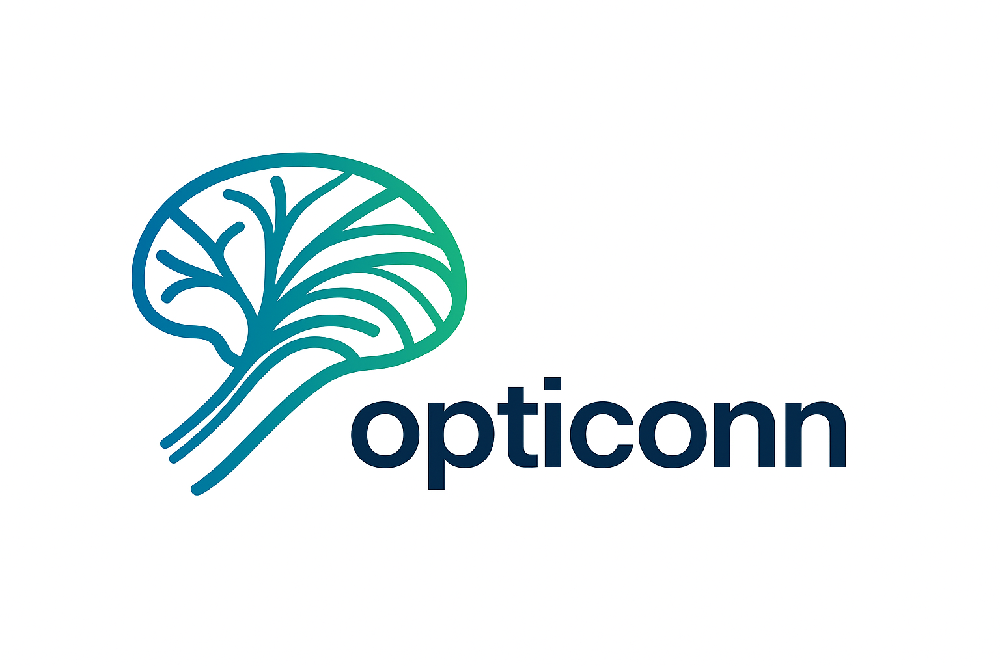

# OptiConn Docs

Welcome to the OptiConn documentation. OptiConn automates tractography parameter discovery (Bayesian optimization) and validation (cross-validation bootstrap), then applies optimal parameters to produce analysis-ready connectivity outputs.

- For setup, see [Installation](installation.md).
- For day-to-day runs, see [Workflows](workflows.md) and [Demos](demos.md).
- For configuration details, see [Configuration](configuration.md) and [Validation Notes](validation.md).
- For background, see [User Guide](user_guide.md) and [Methods](methods.md).

## Quick links

- Bayesian + Apply demo: `python scripts/opticonn_demo.py --step all`
- Cross-validation demo (seeds from Bayes): `python scripts/opticonn_cv_demo.py --workspace demo_workspace_cv`
- DSI Studio download: https://github.com/frankyeh/DSI-Studio/releases

---

**Affiliation**

- MRI-Lab Graz
- Contact: karl.koschutnig@uni-graz.at
# OptiConn Docs

Welcome to the OptiConn documentation. OptiConn automates tractography parameter discovery (Bayesian optimization) and validation (cross-validation bootstrap), then applies optimal parameters to produce analysis-ready connectivity outputs.

- For setup, see [Installation](installation.md).
- For day-to-day runs, see [Workflows](workflows.md) and [Demos](demos.md).
- For configuration details, see [Configuration](configuration.md) and [Validation Notes](validation.md).
- For background, see [User Guide](user_guide.md) and [Methods](methods.md).

## Quick links

- Bayesian + Apply demo: `python scripts/opticonn_demo.py --step all`
- Cross-validation demo (seeds from Bayes): `python scripts/opticonn_cv_demo.py --workspace demo_workspace_cv`
- DSI Studio download: https://github.com/frankyeh/DSI-Studio/releases
