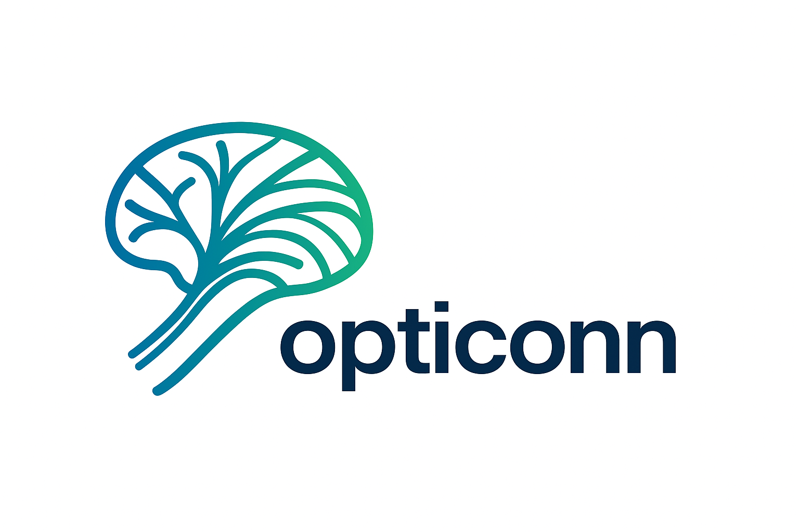

# OptiConn Docs

White matter tractography lacks a gold standard for parameter settings, and most publications offer little rationale for their choices—parameters are often selected arbitrarily or by convention. This becomes critical when deriving structural connectomes for graph-theoretic analyses, where parameter decisions directly influence network topology and derived measures.

OptiConn does not claim to find the optimal parameter set — there is no ground truth to check it against. Instead it screens candidate settings on explicit, testable criteria: **discriminability** (can repeated tracking runs of the same subject be told apart from other subjects, above tracking noise?) and plausibility gates, then applies the best-screened setting to the full dataset. A prior composite quality score is still computed and reported for context, but no longer drives selection — see [Methods](methods.md) for why.

Two backends are supported: **DSI Studio** (the original backend) and **MRtrix3** (`tckgen`/`tck2connectome`, with QSIRecon/qsiprep auto-discovery) via `--backend mrtrix`.

- For setup, see [Installation](installation.md).
- For day-to-day runs, see [Workflows](workflows.md) and [Demos](demos.md).
- For configuration details, see [Configuration](configuration.md) and [Validation Notes](validation.md).
- For background, see [User Guide](user_guide.md) and [Methods](methods.md).

## Quick links

- Bayesian + Apply demo: `python scripts/opticonn_demo.py --step all`
- Cross-validation demo (seeds from Bayes): `python scripts/opticonn_cv_demo.py --workspace demo_workspace_cv`
- DSI Studio download: https://github.com/frankyeh/DSI-Studio/releases

---

**Affiliation**

- MRI-Lab Graz
- Contact: karl.koschutnig@uni-graz.at
